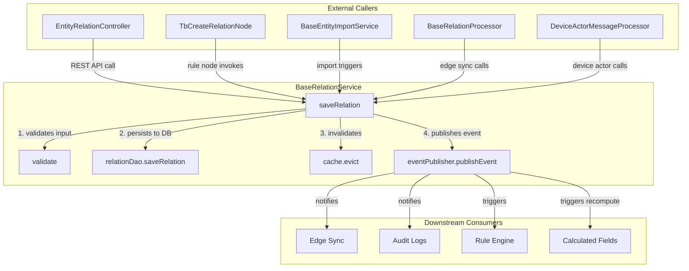

# Assignment 2 – Impact Analysis

## 1. Addressed Component

**Component Selected:** `BaseRelationService`  
**File Path:** `dao/src/main/java/org/thingsboard/server/dao/relation/BaseRelationService.java`  
**Graph Type:** Call Graph

**Description:**  
This PR contains an impact analysis of the `BaseRelationService`, specifically focusing on the `saveRelation` method.  
I selected this component because it acts as the central orchestration layer for all entity relationships (devices, assets, customers) within the platform. It manages validation, persistence, cache eviction, and event publishing, making it a critical "Gatekeeper" for data integrity.

## 2. Impact Analysis Graph

I have constructed a **Call Graph** to visualize the dependencies, showing both the external callers (High Fan-In) and the downstream consumers of the events published by this service.

## 3. Impact & Insights

**Architectural Role:**  
The analysis identifies `BaseRelationService` as the **Central Controller** for all relation operations. It acts as a gatekeeper between callers and the database, ensuring that no relationships are created without passing through validation and cache management logic.

**Regression Risks:**

> [!CAUTION]
> **Critical dependencies:** Rule Engine nodes, Edge Sync, and Calculated Fields rely on this service.

A bug in this service would cause system-wide issues:

- **Rule Chain Failures:** Automation pipelines using relation-based routing would break.
- **Edge Desynchronization:** Distributed Edge devices would fail to receive topology updates.
- **Stale Data:** Failure in the cache eviction logic (`cache.evict`) would result in queries returning outdated relationships.
- **Compliance Gaps:** Missing events would result in incomplete Audit Logs.

**Conclusion:**  
`BaseRelationService` is a vital component because it represents the "connective tissue" of the platform. Any modification to this file requires rigorous testing, specifically focusing on cache eviction strategies and Edge synchronization integration.

Dear Dr. Nasuha, here is my Assignment 2 impact analysis submission. Please review it. Thank you.
