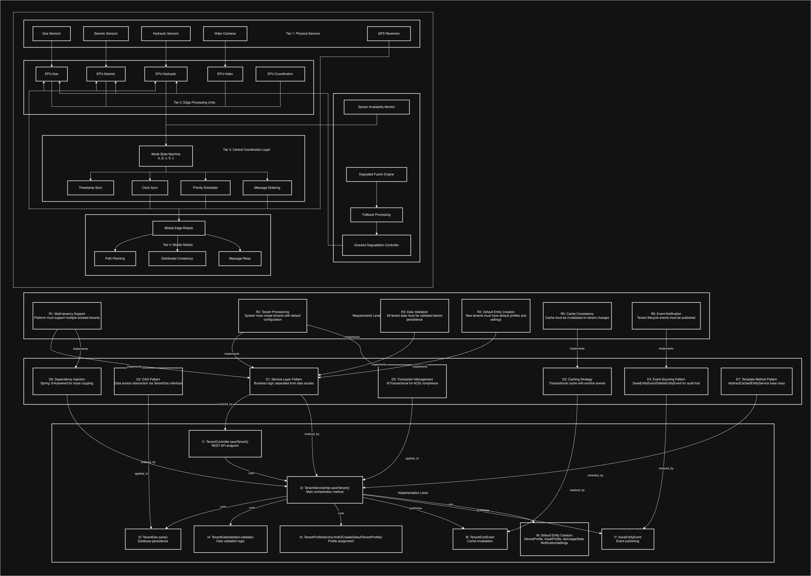
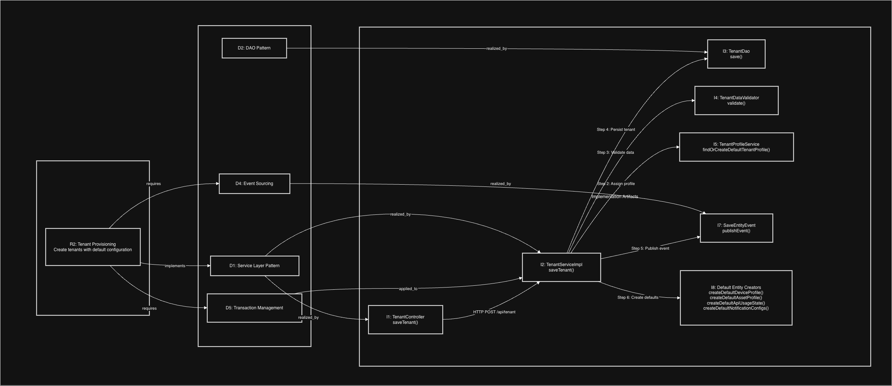

# Assignment 2 – Impact Analysis: Traceability Graph

## 1. Addressed Component

**Component Selected**: `TenantServiceImpl.saveTenant(Tenant tenant, Consumer<TenantId> defaultEntitiesCreator)`

**File Path**: `dao/src/main/java/org/thingsboard/server/dao/tenant/TenantServiceImpl.java` (lines 129-160)

**Rationale**: I selected the `saveTenant` method in `TenantServiceImpl` for this traceability analysis because it represents a critical orchestration point in the ThingsBoard multi-tenant IoT platform. This method demonstrates clear traceability from business requirements (multi-tenancy, tenant provisioning) through architectural design patterns (Service Layer, DAO, Event Sourcing) to concrete implementation artifacts. The method's complexity—involving validation, persistence, caching, event publishing, and default entity creation—makes it an ideal candidate for demonstrating how requirements flow through the system architecture.

## 2. Impact Analysis Graph & Completeness

I have constructed a **Traceability Graph** to visualize the relationships between requirements, design patterns, and implementation artifacts for the tenant provisioning functionality.

### Graph Type: Traceability Graph

A Traceability Graph illustrates how business requirements are translated into design decisions and ultimately implemented in code. This analysis maps three levels:

- **Requirements Level (R)**: Business needs and functional requirements
- **Design Level (D)**: Architectural patterns and design decisions
- **Implementation Level (I)**: Concrete code artifacts and classes

### Diagram 1: Complete Traceability Graph

**Completeness**: The graph maps 6 requirements, 7 design patterns, and 8 implementation artifacts with labeled traceability relationships (implements, realized_by, uses, etc.).

### Diagram 2: Focused Traceability Path - Tenant Provisioning Flow

**Completeness**: This focused diagram shows the critical execution path with 7-step flow from requirement through design to implementation, highlighting the orchestration point (I2).

## 3. Impact & Insights

Based on the Traceability Graph analysis, I derived the following insights:

**Complete Traceability Chain**: Every requirement has corresponding design patterns and implementation artifacts, demonstrating good architectural discipline. For example, R2 (Tenant Provisioning) traces through D1, D5, D4 to I1, I2, I3, I7, I8.

**Layered Architecture Benefits**: Clear separation across Requirements → Design → Implementation layers enables impact analysis. When R4 (Default Entity Creation) changes, developers can trace through D1 to I2 and I8, identifying all affected code locations.

**Dependency Complexity**: `TenantServiceImpl.saveTenant()` (I2) is a critical orchestration point with dependencies on 6 implementation artifacts (I3-I8), indicating high impact for changes and requiring comprehensive testing.

**Design Pattern Consistency**: Consistent application of Service Layer, DAO, and Event-driven patterns improves maintainability as developers can predict where to find related functionality.

**Maintenance Impact**: The traceability enables change impact analysis—modifying R2 requires changes to I2, I3, I5, I7, I8, making it easier to estimate maintenance effort and identify test coverage requirements.

---

@suhadaudd11 Dear Dr. Nasuha, here is my Assignment 2 impact analysis submission. Please review it. Thank you.