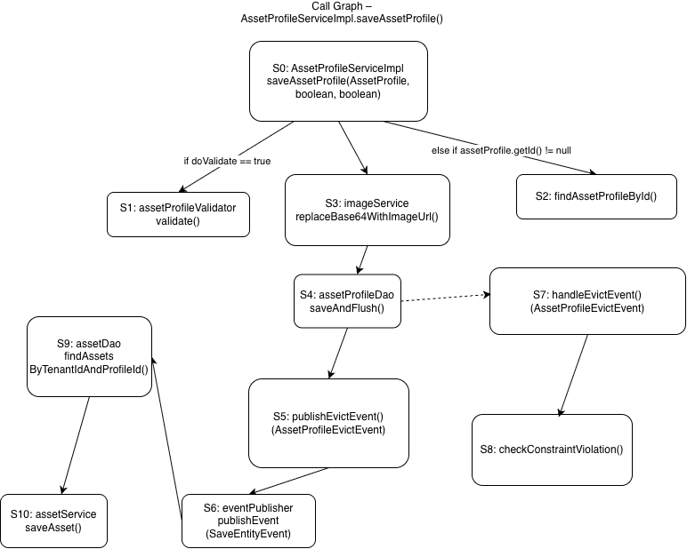

# Assignment 2 – Impact Analysis

## 1. Addressed Component

**Component Selected:**  
AssetProfileServiceImpl.saveAssetProfile(AssetProfile assetProfile, boolean doValidate, boolean publishSaveEvent)

**File Path:**  
dao/src/main/java/org/thingsboard/server/dao/asset/AssetProfileServiceImpl.java

**Rationale:**  
The `saveAssetProfile` method is a core service operation responsible for managing asset profile persistence.  
It coordinates validation, image preprocessing, database persistence, cache eviction, event publishing,  
and conditional cascading updates to related Asset entities, making it suitable for impact analysis.

---

## 2. Impact Analysis Graph & Completeness

**Graph Type:** Call Graph

### Covered Execution Paths:
- Validation and retrieval of the previous asset profile based on the `doValidate` flag.
- Image preprocessing before persistence.
- Database write using `assetProfileDao.saveAndFlush`.
- Cache eviction and event publishing after successful persistence.
- Exception handling with constraint violation checks.
- Cascading updates to related assets when the asset profile name changes.

### Completeness Justification:
The Call Graph captures all significant method invocations and conditional branches that influence  
data persistence, cache consistency, event-driven behavior, and downstream entity updates.  
Trivial operations such as logging are excluded as they do not affect inter-component dependencies.
