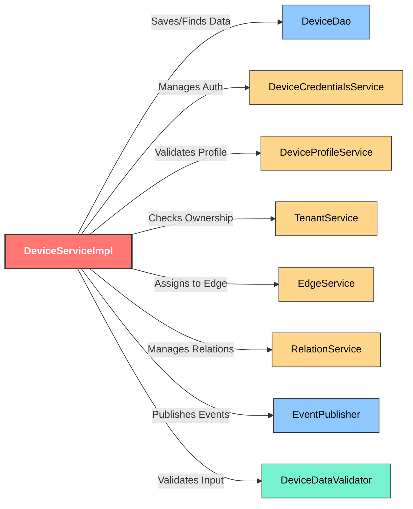

# Assignment 2 - Impact Analysis

## Component Selected: `DeviceServiceImpl`
**Path**: `dao/src/main/java/org/thingsboard/server/dao/device/DeviceServiceImpl.java`

`DeviceServiceImpl` is the core core service implementation responsible for managing the lifecycle of Device entities in ThingsBoard. It handles device provisioning, credentials management, attributes, validation, and relationships with other entities like Tenants and Edges.

## Impact Analysis Graph: Program Dependency Graph
The following **Program Dependency Graph (PDG)** illustrates the architectural wiring of `DeviceServiceImpl`. It visualizes the classes and services that `DeviceServiceImpl` depends on to function.

**Legend:**
*   **Target**: The component being analyzed.
*   **Infrastructure**: Database access (DAO) and Transaction management.
*   **Services**: Other business logic modules it orchestrates.
*   **Validation**: Input checking logic.

## Insights & Impact
1.  **Orchestrator Role**: The graph clearly shows `DeviceService` acting as a "Coordinator". It doesn't just write to a database; it coordinates `Credentials`, `Profiles`, `Edges`, and `Relations`. This validates its role as a central Business Logic component.
2.  **High Coupling**: The service has a high degree of efferent coupling (outgoing dependencies > 10). This is expected for a core entity service but means changes in peripheral services (like `DeviceProfileService`) can easily break `DeviceService`.
3.  **Transactional Complexity**: The dependency on `EventPublisher` and various other services within a `@Transactional` context (as seen in source code) implies that performance issues in any dependency (e.g., slow `EdgeService` lookup) will lock database transactions for Device updates.
4.  **Testing Strategy**: Unit testing `DeviceServiceImpl` requires mocking a significant number of dependencies (Dao, Credentials, Profile, Tenant, Edge, etc.), as shown by the number of outgoing nodes in the graph.
