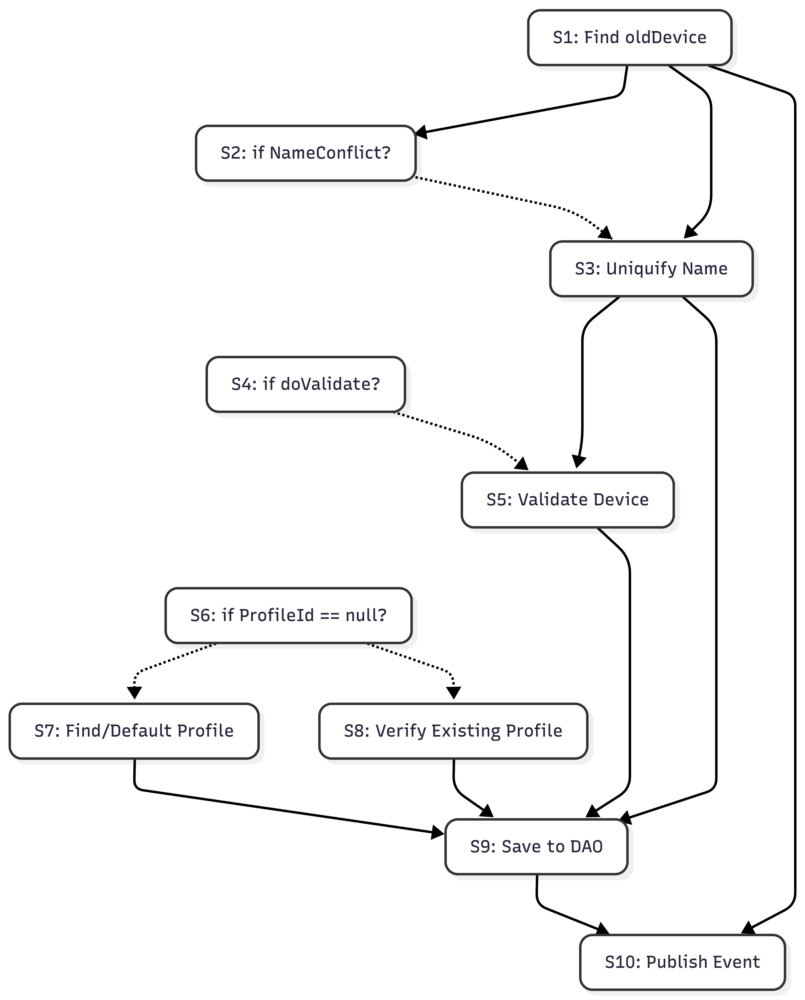

# Assignment 2 - Impact Analysis

## Component Selected: `DeviceServiceImpl.saveDevice()`
**Path**: `dao/src/main/java/org/thingsboard/server/dao/device/DeviceServiceImpl.java`

I selected the `saveDevice` method (specifically the `doSaveDeviceWithoutCredentials` internal logic) for this analysis. This method contains complex control flow and data manipulation, making it ideal for a **Program Dependency Graph (PDG)** analysis as per the lecture guidelines.

## Impact Analysis Graph: Program Dependency Graph (PDG)
The following graph represents the **Statement-Level PDG** for the `saveDevice` logic.
*   **Nodes**: Represent specific program statements (S1-S9).
*   **Solid Edges**: Data Dependencies (variable usage).
*   **Dashed Edges**: Control Dependencies (execution flow based on conditions).

## Insights & Impact
1.  **Critical Path**: The graph shows that `S9 (Save to DAO)` is the sink for almost all data paths. Every upstream decision (Uniquify Name, Validate, Profile Lookup) strictly governs the state of the object reaching `S9`.
2.  **Control Complexity**: The Control Dependency from `S6` (Profile Check) splits the flow significantly. Validating `DeviceProfile` is a major precondition for persistence; errors here abort the entire flow.
3.  **Data Integrity**: `S1` determining `oldDevice` feeds into both Name Conflict resolution (`S2`) and Event Publication (`S10`). If `S1` fails or returns stale data (e.g., caching issue), it corrupts both the current update logic and the downstream audit logs.
4.  **Modification Impact**: The graph demonstrates a robust design for extension. For example, if we need to add a new validation rule (e.g., "Check Label"), we can see exactly where to insert it without breaking the core flow:

### Scenario: Adding a New "Label Check" Rule
The below **Hypothetical PDG** shows how easily a new rule (`S5.1`) integrates. It simply taps into the existing Control Flow (`S4`) and guards the Data Sink (`S9`), verifying high maintainability.

