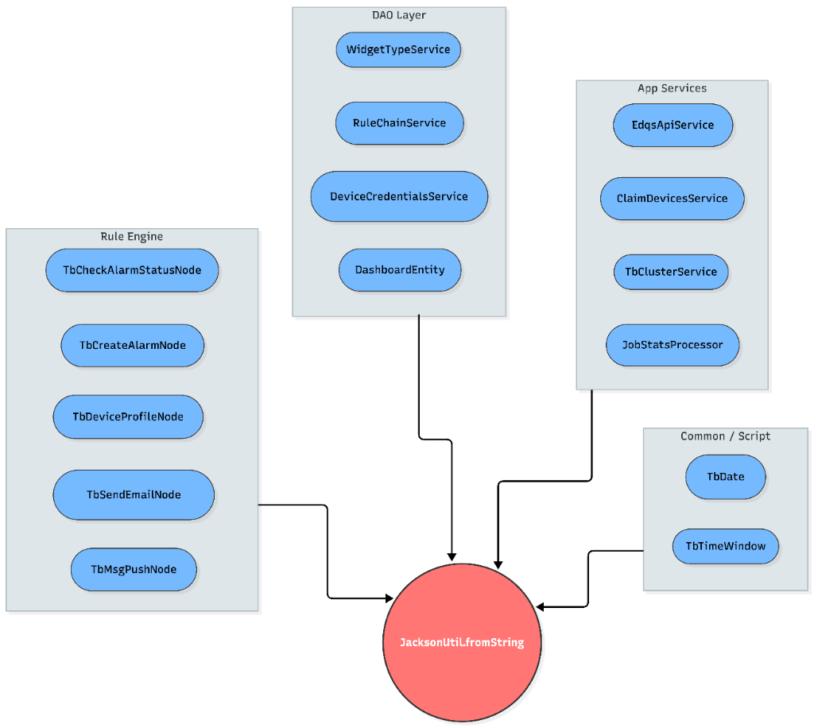

# Assignment 2 - Impact Analysis

## Component Selected: `JacksonUtil`
**Path**: `common/util/src/main/java/org/thingsboard/common/util/JacksonUtil.java`

`JacksonUtil` is a core utility class in ThingsBoard used for JSON serialization and deserialization. It wraps the Jackson library to provide a standardized way to handle JSON operations across the entire platform.

## Impact Analysis Graph: Call Graph
The following **Call Graph** illustrates the diverse modules that directly depend on `JacksonUtil.fromString()`. Due to the high volume of callers (over 400+ occurrences), dependencies are grouped by architectural layers to demonstrate the breadth of impact.

## Insights & Impact
1.  **High Afferent Coupling**: `JacksonUtil` has a massive number of incoming dependencies. It is a "Stable" dependency in the Stable Dependencies Principle (SDP) sense; it is hard to change because so many things depend on it.
2.  **Single Point of Failure**: A defect in `JacksonUtil.fromString()` (e.g., improper error handling or a security vulnerability like unsafe deserialization) would propagate immediately to:
    *   **Data Ingestion**: Rule Engine nodes would fail to process telemetry.
    *   **Data Persistence**: DAO entities would fail to read/write JSON fields.
    *   **API Availability**: Services relying on it for request/response parsing would error out.
3.  **Maintenance Protocol**: Any change to this class requires a **full system regression test**. It is not sufficient to unit test `JacksonUtil` in isolation; the integration points (Rule Engine, Database, API) must all be verified.
4.  **Performance Criticality**: Since it sits in the hot path of telemetry processing (Rule Engine), its performance directly dictates the throughput of the IoT system.
